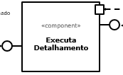
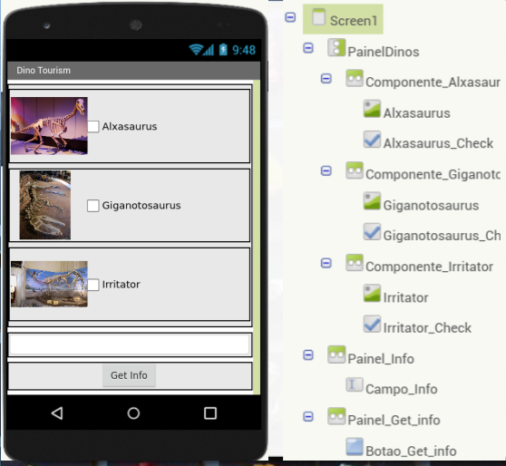

# Apresentação da Equipe e Relatório do Projeto

# Projeto `Final`

# Equipe
* `Luciano Sávio de Oliveira`

# Nível 1

> Apresente aqui o detalhamento do Nível 1 conforme detalhado na especificação com, no mínimo, as seguintes subseções:

## Diagrama Geral do Nível 1

> Apresente um diagrama conforme o modelo a seguir:

### Detalhamento da interação de componentes

> O detalhamento deve seguir um formato de acordo com o exemplo a seguir:

* O componente `Leilão` inicia o leilão publicando no barramento a mensagem de tópico "`auction/{auctionId}/start`" através da interface `AuctionStart`, iniciando um leilão.
* Os componentes Loja assinam no barramento mensagens de tópico "`auction/+/start`" através da interface `AuctionEngage`. Quando recebe uma mensagem…

> Para cada componente será apresentado um documento conforme o modelo a seguir:

## Componente `<Nome do Componente>`

> Resumo do papel do componente e serviços que ele oferece.

> Diagrama do componente, conforme exemplo a seguir:

**Interfaces**
> Listagem das interfaces do componente.

As interfaces listadas são detalhadas a seguir:

## Detalhamento das Interfaces

### Interface `<nome da interface>`

> Resumo do papel da interface.

> Dados da interface podem ser apresentados em formato texto, conforme exemplo:

* Type: `sink`
* Topic: `pedido/+/entrega`
* Message type: `Order`

> Ou em formato de imagem, conforme exemplo:

> Diagrama representando o esquema das mensagens JSON utilizadas na interface, pode ser em formato texto conforme exemplo:

~~~json
{
  orderId: string,
  dueDate: date,
  total: number,
  items: [
    {
         itemid: string,
         quantity: number
    }
  ]  
}
~~~

> Ou em formato de imagem, conforme exemplo:

# Nível 2

## Diagrama do Nível 2

> 

### Detalhamento da interação de componentes

* O componente `Gerencia Pesquisa` envia a palavra chave para o componente `Preenchimento de Palavra Chave`. Este por sua vez assina no barramento mensagens de tópico "`produto/+/oferta`" através da interface `Consulta Ofertas`. Ao receber uma mensagem de tópico "`produto/+/oferta`", são listadas as ofertas para o produto buscado.
* Caso a opção seja por seleção de categorias, o componente `Gerencia Pesquisa` envia a palavra chave para o componente `Seleção de Produtos`. Este por sua vez assina no barramento mensagens de tópico "`produto/+/oferta`" através da interface `Consulta Ofertas`. Ao receber uma mensagem de tópico "`produto/+/oferta`", são listadas as ofertas para o produto buscado.
* Ao selecionar um produto, o componete `Gerencia Pesquisa` envia os dados para o componente `Gerencia Chamada` que dispara ao componente `Executa Detalhamento`. Este por sua vez solicita a loja através da interface `Consulta Disponibilidade` uma posição de estoque para o produto selecionado.
* O componente `Executa Detalhamento` assina no barramento mensagens de tópico "`produto/+/disponibilidade`" através da interface `Assina Leilão`. Desta maneira o componente `Executa Detalhamento` carrega o mesmo produto disponível em outras lojas.

## Componente `Gerencia Pesquisa`

> Resumo do papel do componente e serviços que ele oferece.

## Componente `Preenchimento de Palavra Chave`

> Resumo do papel do componente e serviços que ele oferece.

## Componente `Seleção de Produtos`

> Resumo do papel do componente e serviços que ele oferece.

## Componente `Gerencia Chamada`

> Resumo do papel do componente e serviços que ele oferece.

## Componente `Executa Detalhamento`

> Resumo do papel do componente e serviços que ele oferece.

**Interfaces**
> Listagem das interfaces do componente.

As interfaces listadas são detalhadas a seguir:

## Detalhamento das Interfaces

### Interface `<nome da interface>`

> Resumo do papel da interface.

Método | Objetivo
-------| --------
`<id do método>` | `<objetivo do método e descrição dos parâmetros>`

## Exemplos:

### Interface `ITableProducer`

Interface provida por qualquer fonte de dados que os forneça na forma de uma tabela.

Método | Objetivo
-------| --------
`requestAttributes` | Retorna um vetor com o nome de todos os atributos (colunas) da tabela.
`requestInstances` | Retorna uma matriz em que cada linha representa uma instância e cada coluna o valor do respectivo atributo (a ordem dos atributos é a mesma daquela fornecida por `requestAttributes`.

### Interface `IDataSetProperties`

Define o recurso (usualmente o caminho para um arquivo em disco) que é a fonte de dados.

Método | Objetivo
-------| --------
`getDataSource` | Retorna o caminho da fonte de dados.
`setDataSource` | Define o caminho da fonte de dados, informado através do parâmetro `dataSource`.

## Diagrama do Nível 3

> Apresente uma imagem com a captura de tela de seu protótipo feito no MIT App Inventor, conforme modelo a seguir:

> Apresente o diagrama referente ao protótipo conforme o modelo a seguir:

### Detalhamento da interação de componentes

> O detalhamento deve seguir o mesmo formato usado no Nível 2.
