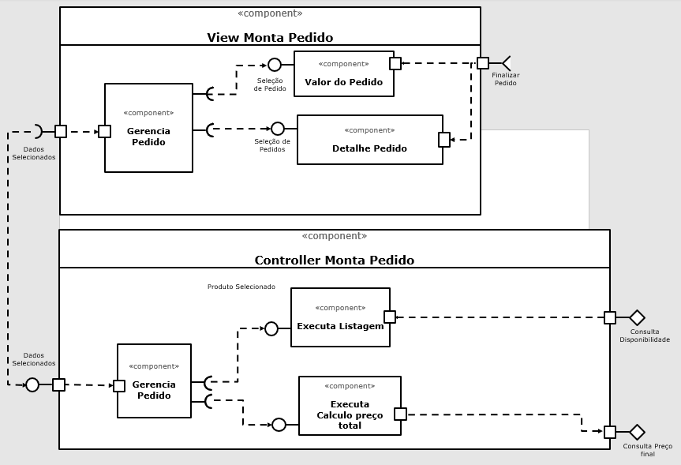
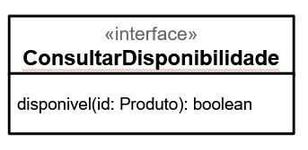
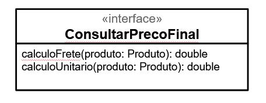
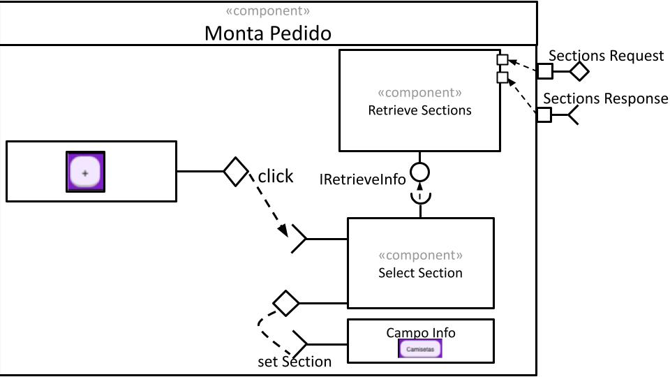
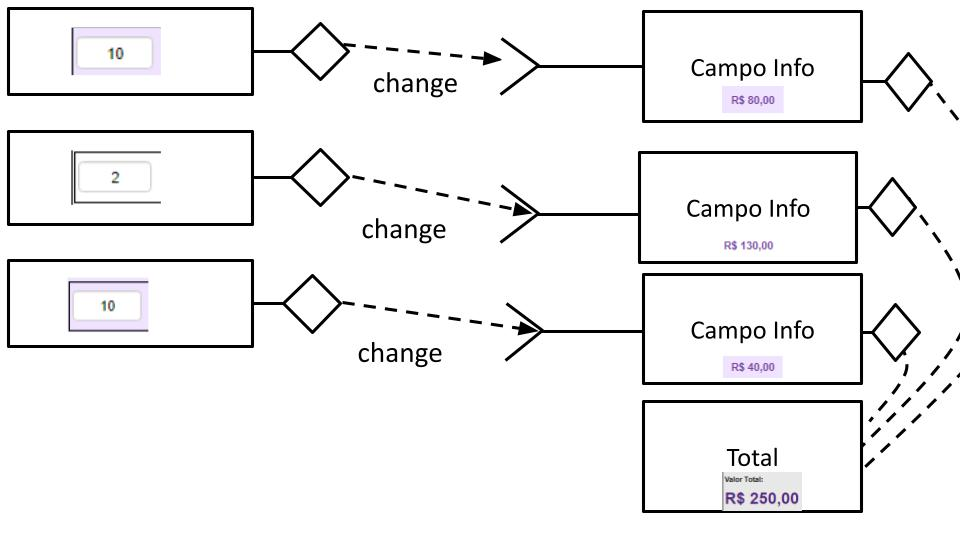
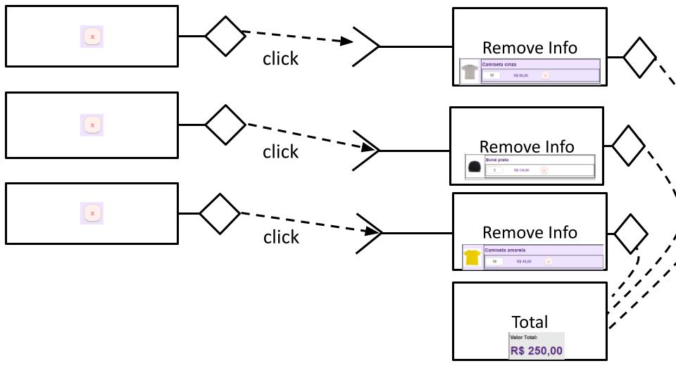

# Apresentação da Equipe e Relatório do Projeto

# Projeto `Final`

# Equipe
* `André Fagundes Carvalho`
* `Carolina Gonçalves Mira`
* `Érmiston Luiz Reis Tavares`
* `Gabriel Rodrigues Modesto`
* `Luciano Sávio de Oliveira`
* `Vinicius Del Padre`

# Nível 1

> Apresente aqui o detalhamento do Nível 1 conforme detalhado na especificação com, no mínimo, as seguintes subseções:

## Diagrama Geral do Nível 1

> Apresente um diagrama conforme o modelo a seguir:

### Detalhamento da interação de componentes

> O detalhamento deve seguir um formato de acordo com o exemplo a seguir:

* O componente `Leilão` inicia o leilão publicando no barramento a mensagem de tópico "`auction/{auctionId}/start`" através da interface `AuctionStart`, iniciando um leilão.
* Os componentes Loja assinam no barramento mensagens de tópico "`auction/+/start`" através da interface `AuctionEngage`. Quando recebe uma mensagem…

> Para cada componente será apresentado um documento conforme o modelo a seguir:

## Componente `<Nome do Componente>`

> Resumo do papel do componente e serviços que ele oferece.

> Diagrama do componente, conforme exemplo a seguir:

**Interfaces**
> Listagem das interfaces do componente.

As interfaces listadas são detalhadas a seguir:

## Detalhamento das Interfaces

### Interface `<nome da interface>`

> Resumo do papel da interface.

> Dados da interface podem ser apresentados em formato texto, conforme exemplo:

* Type: `sink`
* Topic: `pedido/+/entrega`
* Message type: `Order`

> Ou em formato de imagem, conforme exemplo:

> Diagrama representando o esquema das mensagens JSON utilizadas na interface, pode ser em formato texto conforme exemplo:

~~~json
{
  orderId: string,
  dueDate: date,
  total: number,
  items: [
    {
         itemid: string,
         quantity: number
    }
  ]  
}
~~~

> Ou em formato de imagem, conforme exemplo:

# Nível 2

## Diagrama do Nível 2

> 

### Detalhamento da interação de componentes

* O componente `Gerencia Pedido` envia a quantidade de produtos selecionados com seus respectivos valores para o componente `Valor do Pedido`. Este por sua vez envia o tópico "`produto`" para a interface `Finalizar Pedido`. Ao receber uma mensagem de tópico "`produto`", são listados a disponibilidade e preço final dos produtos.
* O componente `Detalhe Pedido` recebe os produtos selecionados da interface `Finalizar Pedido` e retorna para o componente `Gerencia Pedido`, confirmando assim os produtos selecionados. 
* O componeten `Gerencia Pedido` envia os dados para o componente `Executa Listagem`. Este por sua vez executa a consulta de disponibilidade através do componente `Consulta Disponibilidade`.
* Estando disponível os produtos, o componente `Gerencia Pedido` realiza a interação através do comunicador `Dados Selecionados` e envia os dados para o componente `Executa Calculo preço total`. Este por sua vez calcula o preço total através da interface `Consulta Preço final`.

## Componente `Gerencia Pesquisa`

> Resumo do papel do componente e serviços que ele oferece.

## Componente `Preenchimento de Palavra Chave`

> Resumo do papel do componente e serviços que ele oferece.

## Componente `Seleção de Produtos`

> Resumo do papel do componente e serviços que ele oferece.

## Componente `Gerencia Chamada`

> Resumo do papel do componente e serviços que ele oferece.

## Componente `Executa Detalhamento`

> Resumo do papel do componente e serviços que ele oferece.

**Interfaces**
> Listagem das interfaces do componente.

As interfaces listadas são detalhadas a seguir:

## Detalhamento das Interfaces

### Interface `ConsultarDisponibilidade`

> Resumo do papel da interface.

Método | Objetivo
-------| --------
`disponivel` | Retorna um booleano que indica se o produto em questão está disponível ou não, tendo como parâmetro o identificador `id` do produto

### Interface `ConsultarPrecoFinal`

> Resumo do papel da interface.

Método | Objetivo
-------| --------
`calculoFrete` | Retorna o valor total do custo referente ao frete, tendo como parâmetro a entidade produto
`calculoUnitario` | Retorna o valor total da unidade do produto, tendo como parâmetro a entidade produto

### Interface `FinalizarPedido`

> Resumo do papel da interface.

Método | Objetivo
-------| --------
`disponivel` | Retorna um booleano que indica se o produto em questão está disponível ou não, tendo como parâmetro o identificador `id` do produto
`precoFinal` | Retorno o preco final do produto conforme consulta do preco final do produto

## Diagrama do Nível 3

> Apresente uma imagem com a captura de tela de seu protótipo feito no MIT App Inventor, conforme modelo a seguir:

> Apresente o diagrama referente ao protótipo conforme o modelo a seguir:

### Detalhamento da interação de componentes

> A renderização da tela começa com o carregamento das formas de pagamento, que são provenientes do backend, representados na [imagem 005](images/nivel3/005.jpg). 
> Após a construção da tela, o usuário interage mudando a quantidade dos produtos, conforme [imagem 003](images/nivel3/003.jpg), que acarreta na alteração do valor agregado do produto, além da atualização do total da compra.
> Caso o usuário deseje remover algum produto, é disparado o fluxo representado pela [imagem 004](images/nivel3/004.jpg).
> Ainda é possível adicionar mais produtos, clicando nas seções disponíveis ou pode buscar textualmente, conforme [imagem 001](images/nivel3/001.jpg) e [imagem 002](images/nivel3/002.jpg).
> Quando a compra estiver pronta, o cliente pode iniciar o fluxo de finalização, seguindo a [imagem 006](images/nivel3/006.jpg)